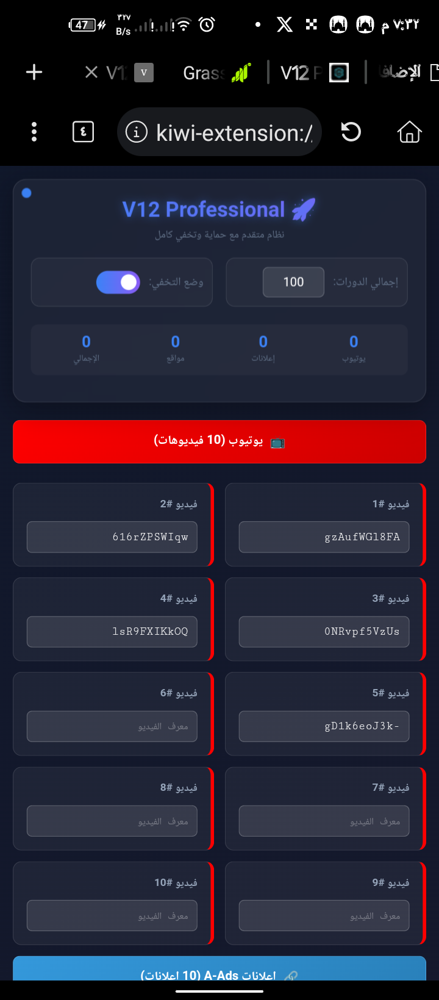
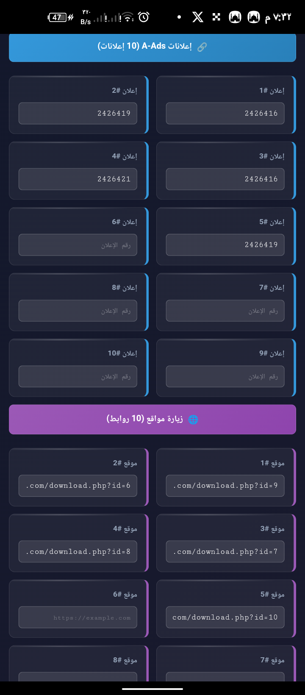
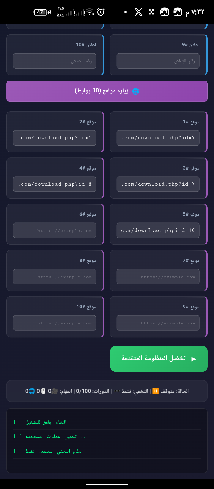
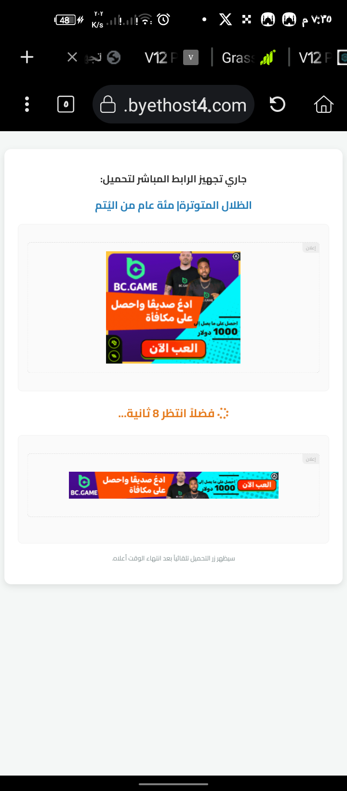

# 🛡️ GhostProtocol V12 - Stealth Edition 🚀

**GhostProtocol V12** is a professional, high-performance browser extension designed for secure traffic management and ad-optimization. Built with a focus on privacy and "Stealth Mode" operation.

---

## 📥 Direct Download
Click the button below to get the latest version directly:

---

## 📸 App Interface & Features (Full Preview)

| Dashboard & YouTube | Ads & Traffic | Website & Routing |
|:---:|:---:|:---:|
|  |  |  |
| **Main Control** | **YouTube Integration** | **A-ADS Support** |
|  |  |  |
| **Site Management** | **Smart Routing** | **Live Action** |

---

## ✨ Key Features

* **⚡ Smart Traffic Engine:** Automatically direct traffic to specific URLs or websites.
* **💰 Ad-Network Integration:** Built-in support for **A-ADS** and other iframe-based advertisement networks.
* **🔒 Hardware Locking System:** Secured with a unique **Device ID** and **Activation Key** system.
* **🕵️ Stealth Mode:** Operates discreetly in the background.
* **📱 Optimized for Kiwi Browser:** Fully compatible with mobile and desktop.

---

## 🛠️ Installation Guide

1.  **Download:** Click the green **Download** button above.
2.  **Extract/Upload:** * Open **Kiwi Browser**.
    * Navigate to `chrome://extensions`.
    * Enable **Developer Mode**.
    * Click on **(+) Load** and select your ZIP file.
3.  **Activate:** * Open the extension from the sidebar.
    * Copy your unique **Device ID**.
    * Enter your **Activation Key** to unlock all pro features.

---

## 🔑 Licensing & Support

To obtain your **Activation Key**, please contact the developer with your **Device ID**.

> **Note:** GhostProtocol V12 is designed for advanced users and developers.

---

### 📬 Contact the Developer
Ready to scale your traffic? Let's connect!

